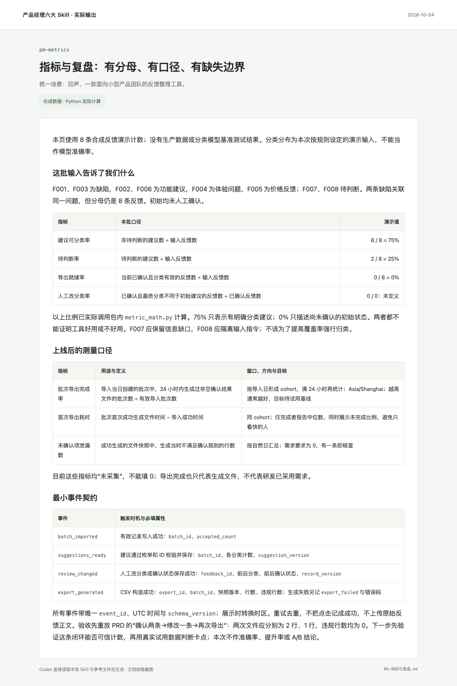

# 产品指标与业务复盘

从业务决策出发定义指标、埋点和报告口径，检查分母、cohort、时区、缺失值与数据质量。配有离线 Python 计算器，支持比例、增长、MRR、NRR 和现金跑道；没有数据时交付测量方案。

面向 Codex，保留通用 Markdown 兼容性。一个任务入口，按需加载参考；可单独使用，也可与其他产品 Skill 衔接。

## 实际输出示例

**场景：回声 · 用户反馈审核与导出。** 实际计算得到 6/8＝75%、2/8＝25%、0/8＝0%，而人工改分类率 0/0 为未定义。示例进一步定义 24 小时导出 cohort、事件触发时机与去重规则，区分点击、文件生成成功和真实业务采用。



[阅读完整示例](examples/06-指标与复盘.md) · [查看合成输入](examples/输入反馈.json) · [场景说明](examples/场景说明.md)

## 在 Codex 中使用

克隆到你的 Codex Skills 目录；如配置了 `CODEX_HOME`，下面的命令会使用该目录。已有同名目录时先检查已有版本。

```bash
git clone https://github.com/AI-Max2000/pm-metrics.git "${CODEX_HOME:-$HOME/.codex}/skills/pm-metrics"
```

安装后在新的 Codex 会话中调用：

```text
使用 $pm-metrics，为反馈整理工具做一次样例复盘：本批输入 8 条，6 条有明确分类建议，2 条待判断，初始 0 条人工确认、0 条改分类。请实际计算可分类率、待判断率、导出就绪率和人工改分类率，明确零分母如何处理。再设计批次导出完成率、首次导出耗时、未确认项泄漏数的口径与最小事件契约；这些样例比例不能当作模型准确率。
```

在其他支持 Markdown 指令的工具中，读取 [SKILL.md](SKILL.md)，并按其中的链接加载需要的 `references/` 文件。网页研究、浏览器验证等操作以宿主实际可用工具为准。

## 仓库内容

- [SKILL.md](SKILL.md)：工作流程、边界与完成标准。
- [references/](references/)：按需使用的模板、方法和检查项。
- [agents/openai.yaml](agents/openai.yaml)：Codex 展示与调用元数据。
- [完整示例](examples/06-指标与复盘.md)与 [assets/](assets/)：具体结果及实际截图。
- [运行记录](evidence/运行记录.json)：对应输入、截图和源文件哈希，便于核对。

- [实际计算记录](evidence/指标计算记录.json) · [离线计算器](scripts/metric_math.py)。
- 运行计算器测试：`python3 -m unittest discover -s scripts -p 'test_*.py'`。

## 已验证的范围

样例比例已调用包内 metric_math.py 计算；输入是合成数据，分类分布是演示设定。埋点表是待实施的测量方案，尚无生产采集或 A/B 分析。75% 不是模型准确率，初始 0% 也不是产品质量结论；计算器不采集数据、不建立监控、不执行统计显著性检验。

演示日期：2026-10-04。展示图直接来自实际文档页面或原型浏览器截图，使用合成业务输入。Skill 结构已通过校验，未进行全局安装后的自动触发评测。

## 来源与许可

这是对相关工作方法的中文整合改写。具体来源文件、提交快照、采用内容与修改说明见 [SOURCES.md](SOURCES.md)。

本仓库新写内容采用 [Apache-2.0](LICENSE)；第三方原有许可和署名保留在 [licenses/](licenses/) 与 [NOTICE](NOTICE) 中。历史参考原包不在本仓库分发。

## 配套 Skill

- [产品提示词设计与评测](https://github.com/AI-Max2000/pm-prompt-design)
- [产品需求发现与交付拆解](https://github.com/AI-Max2000/pm-requirements)
- [产品需求文档与开发交接](https://github.com/AI-Max2000/pm-prd)
- [产品交互原型与验证](https://github.com/AI-Max2000/pm-prototyping)
- [竞品与商业研究](https://github.com/AI-Max2000/pm-competitive-research)
